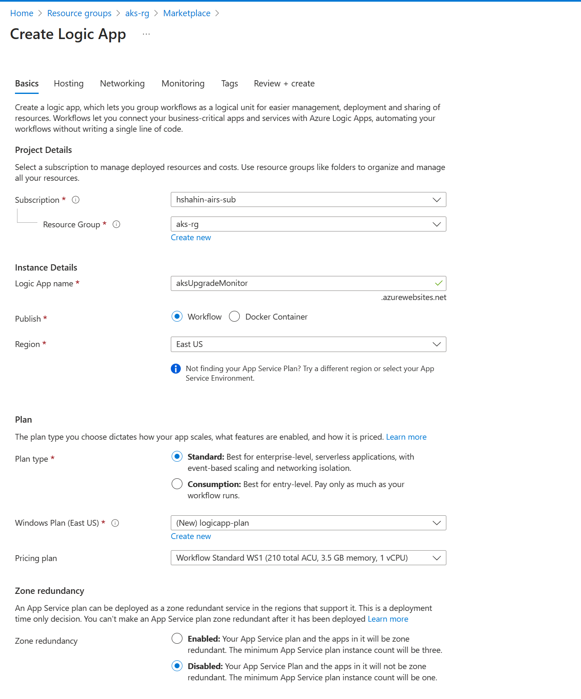
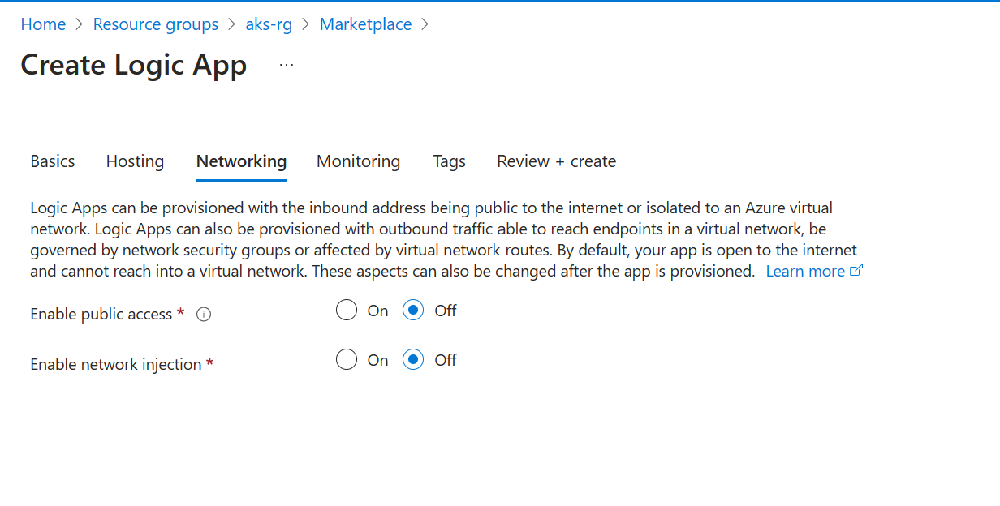
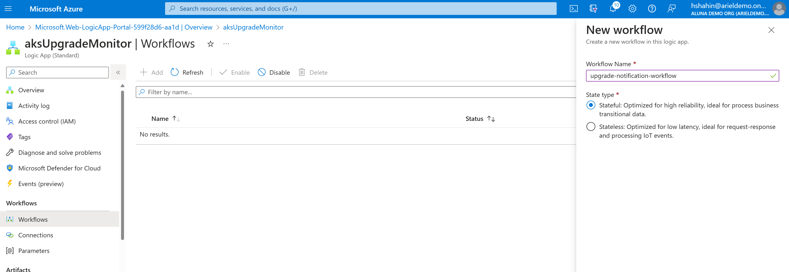
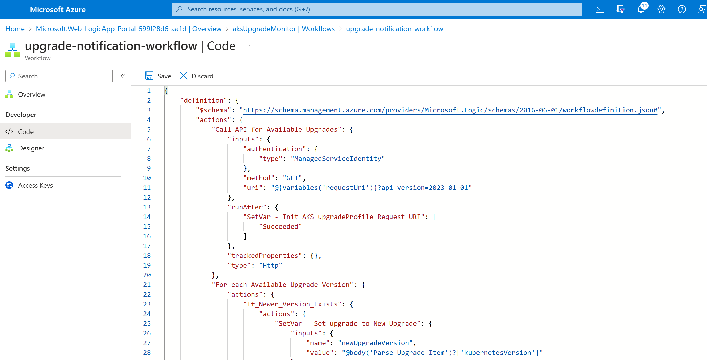
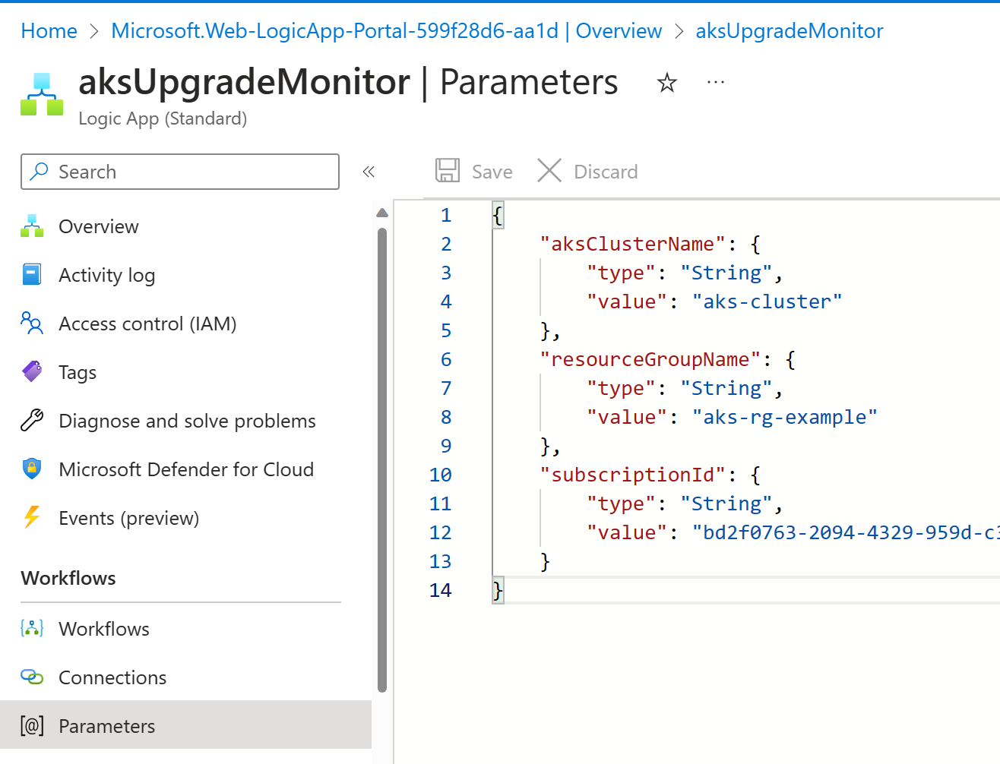
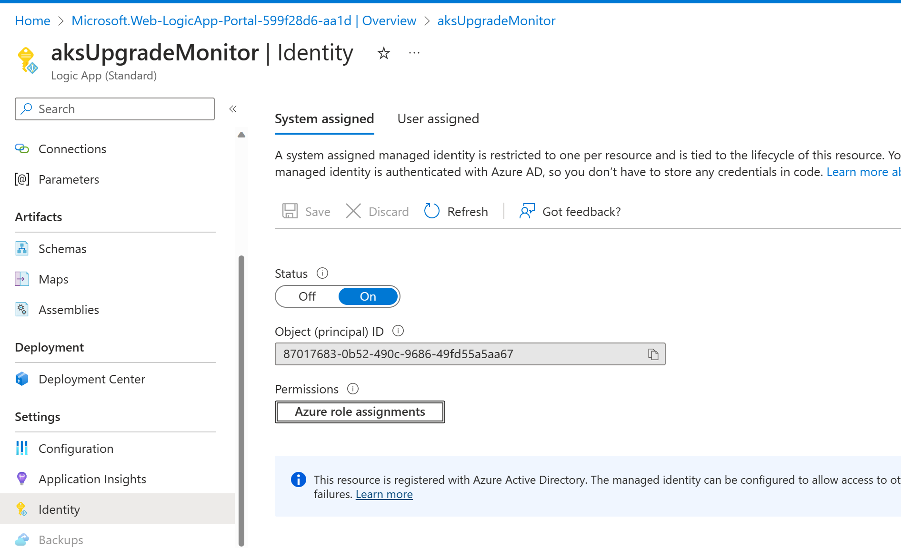
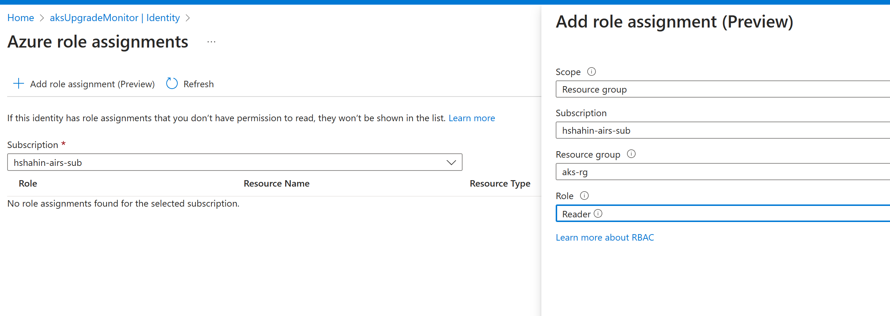
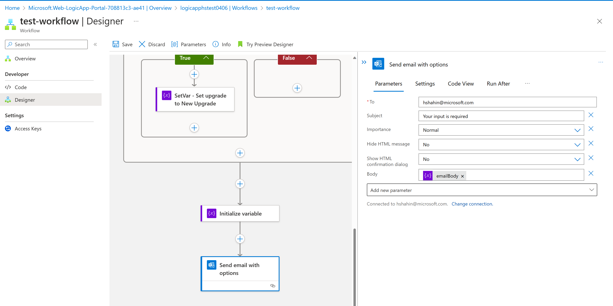

# Steps to Deploy Kubernetes Version Monitor

1. Create a new logic app:
    - You can create a new plan or use an existing plan
    - Since this will run as a recurring trigger, public access can be turned off

    

    

2. Create a workflow in the logic app and copy and paste the `workflow.json` contents:

    

    

3. Copy and update the parameters for your workflow using `parameters.json`:

    

4. Assign a role to the logic app managed identity to read the resource group containing the monitoring AKS Cluster:

    

    

5. As a last step, manually add a send email action so you can receive a notification in your email with the response:

    

6. You can test by triggering the workflow and you should receive an email in your inbox